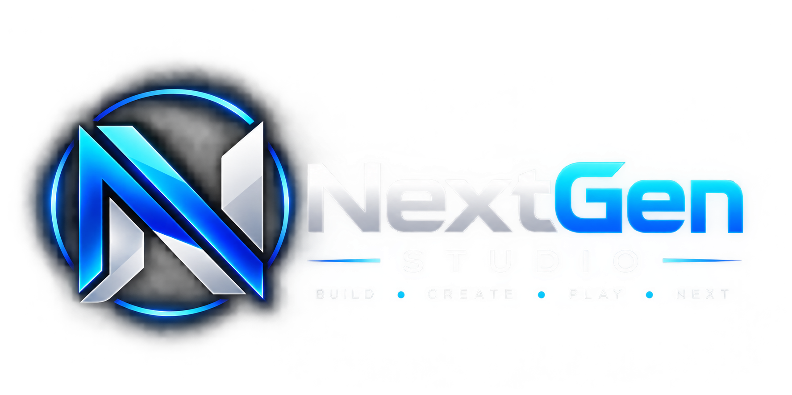

# NextGen Studio — Ankush Pratap Singh Portfolio 🚀

An ultra-premium, responsive software engineer portfolio website built with modern HTML5, CSS3 glassmorphic design system, interactive canvas animations, terminal emulator, and client-side JavaScript.



---

## 🌟 Highlights & Features

- **Design System**: Sleek futuristic dark theme (`#040711`), glassmorphism cards, ambient particle canvas background, 3D card tilt & spotlight hover effects.
- **Hero Terminal Widget**: Interactive IDE code preview tabs (`developer.ts`, `specs.json`, `system.log`), copy code snippet button, and live system diagnostics runner.
- **Featured Projects**: Filterable project workstation showcasing live web apps, Unity 3D AI engines, and published Google Play Store mobile apps with detailed modal views.
- **Live Capability Search**: Real-time interactive search and highlighting for languages, frameworks, databases, and developer tools.
- **SEO & Social Sharing Ready**: Full Open Graph meta tags, Twitter Cards, Schema.org JSON-LD structured data (`Person` & `WebSite`), `robots.txt`, `sitemap.xml`, and `site.webmanifest`.
- **Downloadable Resume**: Bundled high-resolution printable PDF resume (`resume.pdf`).
- **Fully Responsive**: Optimized for desktop, tablet, and mobile with glass drawer navigation and background overlay.

---

## 📁 Repository Structure

```
├── index.html              # Main HTML page structure with SEO & Open Graph meta
├── style.css               # Premium CSS design system, glassmorphism, responsive queries
├── script.js              # Interactive logic (typing effect, particle canvas, filters, modals)
├── resume.pdf              # Print-ready resume document
├── resume.html             # HTML source template for resume
├── favicon.svg             # Modern vector favicon
├── site.webmanifest        # Web App Manifest for mobile installability
├── robots.txt              # Search engine crawler instructions
├── sitemap.xml             # Sitemap index for Google / Bing indexing
├── nextgen-studio-logo.png # NextGen Studio brand mark & social share card image
└── assets/                 # High-definition project preview images
    ├── nextgen_pdf.jpg
    ├── aps_chess.jpg
    └── bhakti_sadhna.jpg
```

---

## 🚀 How to Publish / Host Anywhere

### 1. GitHub Pages (Free & Recommended)
1. Push this repository to GitHub: `https://github.com/NextGen-Studio1/portfolio`
2. Go to **Repository Settings** ➔ **Pages**.
3. Under **Build and deployment** ➔ **Branch**, select `main` (or `master`) branch and `/ (root)` folder.
4. Click **Save**. Your site will be live at `https://<your-username>.github.io/` within seconds!

### 2. Vercel
1. Install Vercel CLI or import via [vercel.com](https://vercel.com).
2. Run `vercel` in your project folder, or connect your GitHub repository for automatic CD/CI deployment.

### 3. Netlify
1. Drag and drop this project folder directly onto [app.netlify.com/drop](https://app.netlify.com/drop), or connect your GitHub repo.

### 4. Firebase Hosting
```bash
npm install -g firebase-tools
firebase login
firebase init hosting
firebase deploy
```

---

## 🛠️ Local Development Preview

To run locally using Python:
```bash
python -m http.server 3000
```
Or using Node.js `npx`:
```bash
npx serve .
```
Open your browser at `http://localhost:3000`.

---

## 👤 Author & Contact

**Ankush Pratap Singh**  
*Full Stack Developer & Software Engineer | NextGen Studio*
- **Email**: [ankushpratapsingh243301@gmail.com](mailto:ankushpratapsingh243301@gmail.com)
- **GitHub**: [github.com/NextGen-Studio1](https://github.com/NextGen-Studio1)
- **LinkedIn**: [linkedin.com/in/ankush-pratap-singh-7758a352](https://www.linkedin.com/in/ankush-pratap-singh-7758a352)
